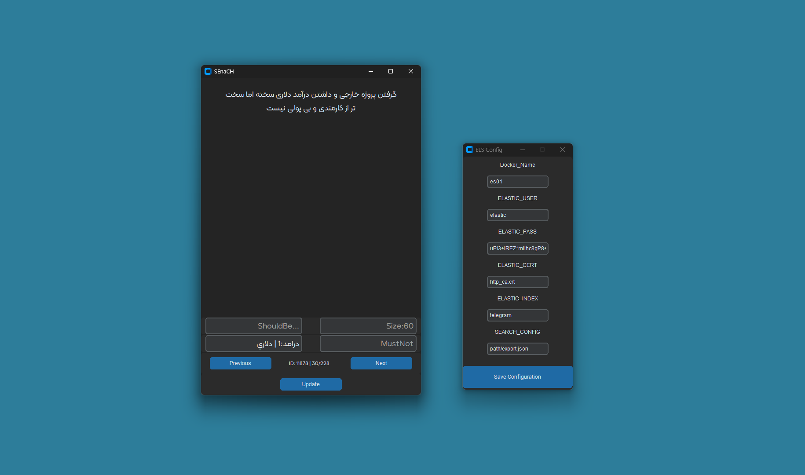
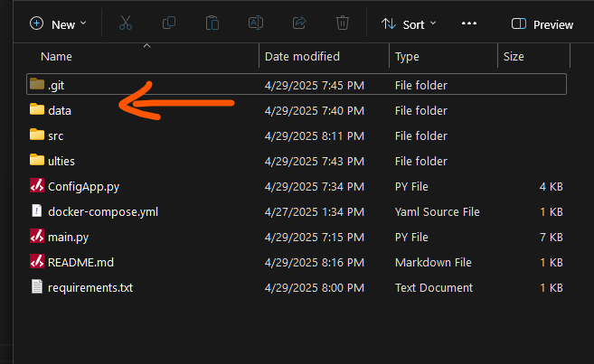

# 🕵️‍♂️ PostHunter

**PostHunter** is a simple yet powerful tool for searching, displaying, and analyzing Telegram export messages. It uses a GUI built with `customtkinter` and integrates with Elasticsearch to index and search Telegram message data efficiently.

---



---

## ⚙️ INSTALLATION

### 1. Install Python 3.11+

```bash
git clone https://github.com/AsmrCodeZ-YT/PostHunter.git
cd PostHunter
pip install -r requirements.txt
```

### 2.Install Docker and Run Elasticsearch

Make sure Docker is installed on your system, then start the Elasticsearch container:

	docker compose up -d

### 3. Copy Telegram Export File to the data Folder

Export your Telegram data using the official Telegram export tool and copy the file into the data/ directory:



### 4. Run the Config App First

Before running the main application, configure settings using:

	python ConfigApp.py

### 5. Run the Main Application

	python MainApp.py


## 🧠 About PostHunter

PostHunter is designed for users who want to explore and search their Telegram data exports (including messages, chats, and groups) with advanced filters and a user-friendly interface. Powered by Elasticsearch, it enables fast searching through large datasets. It's ideal for researchers, analysts, and power users who want insight into Telegram communication patterns.

## ✨ Features

- Clean and modern GUI with customtkinter
- Processes and transforms Telegram JSON export files
- Indexes data into Elasticsearch for high-performance querying
- Simple initial setup via ConfigApp
- Docker integration for automated environment setup


## 📌 TODOs

- Run locally without Docker containers
- Add .sh script for installing Elasticsearch and pip dependencies
- Add export path to environment variables
- Enable auto-insertion of Telegram export data
- Implement TRANSFORM_REQUEST for request transformation before indexing

## 📜 License

This project is licensed under the MIT License. See the LICENSE file for more details.

## 👨‍💻 Developer
Made with ❤️ by AsmrCodeZ-YT